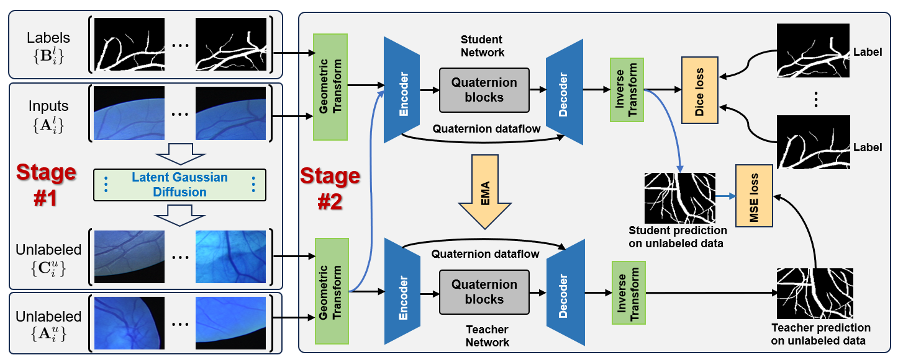

# SemiDif: Quaternion Neural Networks for Semi-Supervised Vessel Segmentation with Latent Diffusion model


We propose SemiDif, a novel semi-supervised learning (SSL) framework based on the latent diffusion model and quaternion neural network. This framework consists of two stages. In the first stage, the latent diffusion model is utilized to generate unlabeled data, reducing the labelling burden. In the second stage, we address two key challenges in semi-supervised vessel segmentation. Firstly, we integrate a differentiable and reversible geometric transformation to augment the data, effectively leveraging the capabilities of consistency-based SSL. Secondly, SemiDif adopts a novel quaternion convolutional network that efficiently captures vessel curve structure features in complex background, enabling it to self-attend to tiny vessels in both horizontal and vertical space.



This demo code reproduces the results for semi-supervised segmentation on STARE, CHASE DB, EM and DRIVE datasets.

Please follow the following pipeline to reproduce the results.

## Requirements

The code is tested under Ubuntu 18.04, CUDA 10.2, PyTorch 1.6.0
Install the required packages through

```
pip install -r requirements.txt
```

## Datasets

Prepare datasets for evaluation.

```
mkdir ./Dataset
cd ./Dataset


## Run training script

Train fully supervised baseline model and SemiDiff model by running the following script.

```
sh train.sh
```

To change the default dataset, please update inside train.sh script.

```commandline
Dataset=DRIVE # dataset to use [option:STARE, CHASE DB, EM and DRIVE]
```
## Training

python main.py --GPU 0 --net ResUnet_Q --Mode train --Epoch 1000 --LearningRate 1e-3 --batchsize 8 --SaveRslt 1 --labelpercent 0.05 --seed_split 0 --loss Dice+ConsistMSE_loss --ssl MeanTeacher --Alpha 0.999 --Gamma 5 -ta DRIVE -vf 2 --MaxTrIter 5 --RampupEpoch 500 --RampupType Exp


##Testing
python main.py --GPU 0 --net ResUnet_Q --Mode test --Epoch 1000 --LearningRate 1e-3 --batchsize 8 --SaveRslt 1 --labelpercent 0.05 --seed_split 0 --loss Dice+ConsistMSE_loss --ssl MeanTeacher --Alpha 0.999 --Gamma 5 -ta DRIVE -vf 2 --MaxTrIter 5 --RampupEpoch 500 --RampupType Exp